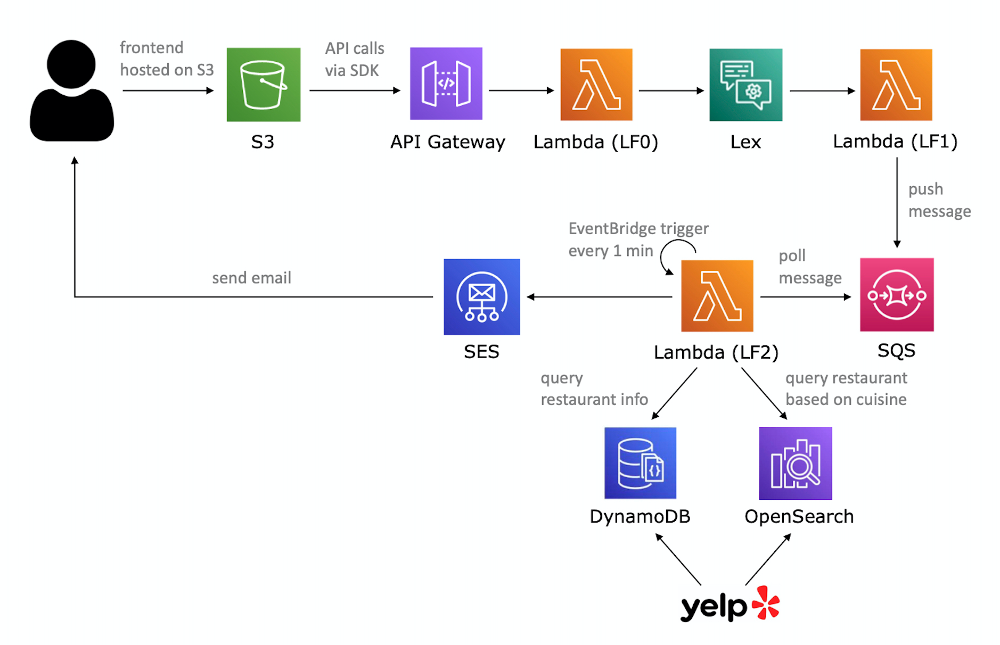

# Chatbot Restaurant #

## Member ##
cl4335
Chun-Hua Lin

## About ##

This is a chatbot demo using the AWS services including:
* API Gateway
* Lambda
* S3
* Lex
* DynamoDB
* OpenSearch
* SQS
* SES

The restaurant data are scrapped using the Yelp fusion API.
## Usage ##

1. Clone the repository.
2. Replace `/assets/js/sdk/apigClient.js` with your own SDK file from API
   Gateway.
3. Configure the AWS services corresponding to the files.
4. Access frontend via [S3](http://spring-2023-cloud-hw1.s3-website-us-east-1.amazonaws.com). (This link is used for my demo thus will not work when services are shut down.)
4. Start sending messages to test the chatbot interaction.

